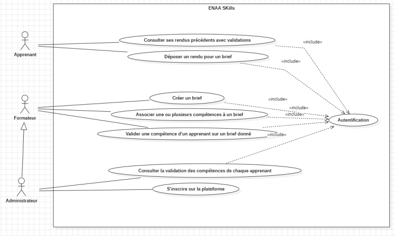
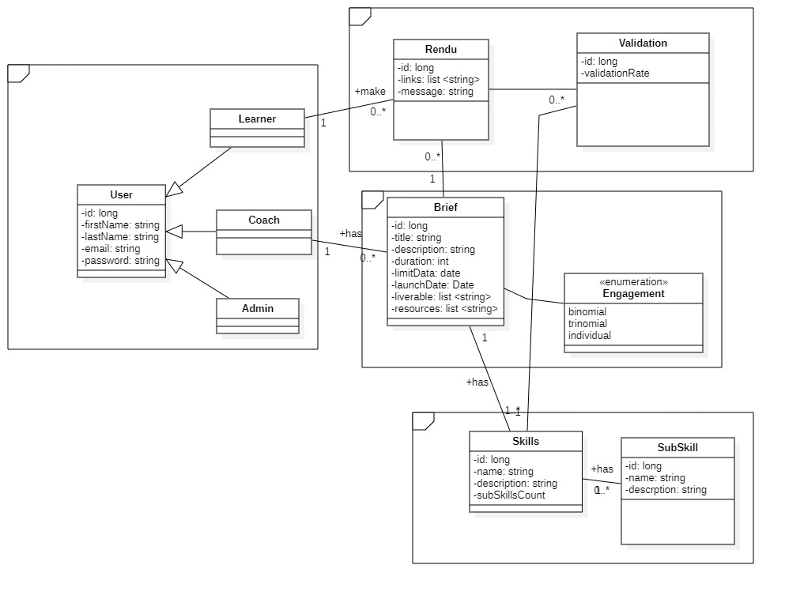
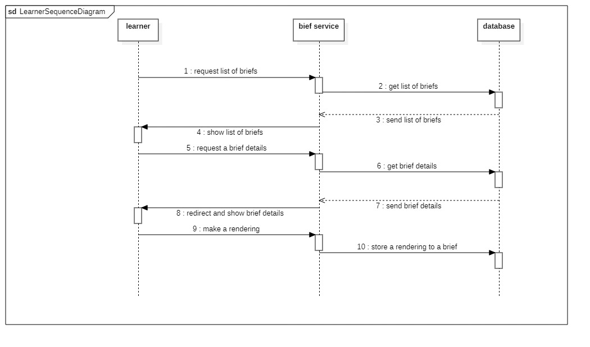

## ⚙️ Skill service (`application.properties`)
#### create resources folder and under create a new file application.properties
folder path: /skill-service/src/main/resources/application.properties
```properties
spring.application.name=skill-service
spring.datasource.url=jdbc:mysql://localhost:3306/skill_db?createDatabaseIfNotExist=true
spring.datasource.username=YOUR_USERNAME
spring.datasource.password=YOUR_PASSWORD

spring.jpa.hibernate.ddl-auto=create
spring.jpa.show-sql=true
spring.jpa.properties.hibernate.format_sql=true
spring.jpa.database-platform=org.hibernate.dialect.MySQL8Dialect

server.port=8081
briefing-service.url=http://localhost:8080
skill-service.url=http://localhost:8081
```

## ⚙️ Brief service (`application.properties`)
#### create resources folder and under create a new file application.properties
folder path: /briefing-service/src/main/resources/application.properties
```properties
spring.application.name=skill-service
spring.datasource.url=jdbc:mysql://localhost:3306/briefdb?createDatabaseIfNotExist=true
spring.datasource.username=YOUR_USERNAME
spring.datasource.password=YOUR_PASSWORD

spring.jpa.hibernate.ddl-auto=update
spring.jpa.show-sql=true
spring.jpa.properties.hibernate.format_sql=true
spring.jpa.database-platform=org.hibernate.dialect.MySQL8Dialect

server.port=8080
briefing-service.url=http://localhost:8080
skill-service.url=http://localhost:8081
```


## ⚙️ Validation service (`application.properties`)
#### create resources folder and under create a new file application.properties
folder path: /validation-service/src/main/resources/application.properties
```properties
spring.application.name=validation-service
spring.datasource.url=jdbc:mysql://localhost:3306/validation_db?createDatabaseIfNotExist=true
spring.datasource.username=YOUR_USERNAME
spring.datasource.password=YOUR_PASSWORD

spring.jpa.hibernate.ddl-auto=update
spring.jpa.show-sql=true
spring.jpa.properties.hibernate.format_sql=true
spring.jpa.database-platform=org.hibernate.dialect.MySQL8Dialect

server.port=8082
briefing-service.url=http://localhost:8080
skill-service.url=http://localhost:8081
validation-service.url=http://localhost:8082
```


### ✅ Use Case Diagram


### ✅ Class Diagram


### ✅ Sequence Diagram



